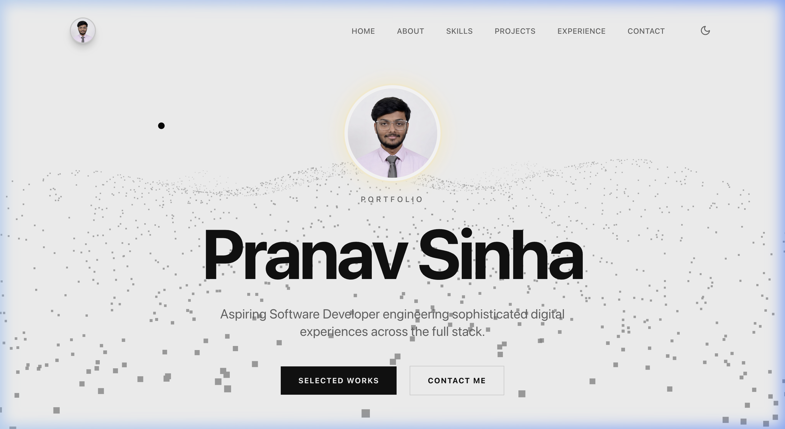

# 🚀 Pranav Sinha | Premium Developer Portfolio

[](https://reactjs.org/)
[](https://tailwindcss.com/)
[](https://greensock.com/)
[](https://threejs.org/)
[](https://vitejs.dev/)

### **Aspiring Software Developer | Frontend & Full Stack Enthusiast**

Welcome to my personal portfolio! This project is a highly interactive, modern, and visually stunning 3D website designed to showcase my journey, technical expertise, and selected works. It's built with a focus on smooth user experience, premium aesthetics, and cutting-edge web technologies.

---

## 📸 Preview


> **Note:** The portfolio features buttery-smooth GSAP animations, a reactive Three.js background, and a dynamic theme engine that aren't fully captured in a static image!

---

## 🔗 Live Demo
✨ **Check it out here:** [Live Website Link](https://pranav-sinha.netlify.app) *(Update this link once deployed)*

---

## ✨ Features
- 🌑 **Dark/Light Mode:** Seamless theme switching with a custom circular clip-path GSAP animation.
- 🎨 **Dynamic Accent Color:** Personalize the UI with a real-time accent color picker.
- 🧊 **3D Background:** Interactive Three.js particle wave background that reacts to mouse movement.
- 🎢 **Horizontal Scrolling:** Custom GSAP ScrollTrigger capabilities section with pinning and smooth inertia.
- 🎞️ **Smooth Animations:** Buttery-smooth entrance and scroll-triggered reveals powered by GSAP.
- 📱 **Fully Responsive:** Meticulously crafted for desktop, tablet, and mobile devices.
- 🖱️ **Custom Cursor:** Interactive magnetic cursor for an enhanced browsing feel.

---

## 🛠️ Tech Stack
- **Frontend Framework:** React.js (Vite)
- **Styling:** Tailwind CSS (Modern monochrome & glassmorphism)
- **Animations:** GSAP (GreenSock Animation Platform)
- **3D Graphics:** Three.js
- **Icons:** Lucide-React
- **Typography:** macOS System Font Stack (San Francisco)

---

## 📂 Project Structure
```text
Portfolio_AG/
├── src/
│   ├── assets/             # Images, icons, and static assets
│   ├── components/         # Modular React components
│   │   ├── About.jsx       # About Me section
│   │   ├── Contact.jsx     # Contact form & social links
│   │   ├── Hero.jsx        # Landing section with 3D background
│   │   ├── Navbar.jsx      # Navigation & Theme toggle
│   │   ├── Projects.jsx    # Selected works showcase
│   │   ├── Skills.jsx      # Interactive horizontal capabilities
│   │   └── ...             # ThemeContext, Loader, CustomCursor
│   ├── App.jsx             # Main Application entry
│   ├── main.jsx            # Entry point for Vite
│   └── index.css           # Global styles & CSS variables
├── public/                 # Static public files
├── tailwind.config.js      # Custom theme & color configuration
└── package.json            # Dependencies & scripts
```

---

## 🚀 Installation & Setup
Follow these steps to run the project locally:

1. **Clone the repository:**
   ```bash
   git clone https://github.com/pranav-ctrl/Portfolio_AG.git
   ```

2. **Navigate to the project directory:**
   ```bash
   cd Portfolio_AG
   ```

3. **Install dependencies:**
   ```bash
   npm install
   ```

4. **Run the development server:**
   ```bash
   npm run dev
   ```

5. **Build for production:**
   ```bash
   npm run build
   ```

---

## 📁 Featured Projects
- **GFG Campus Platform:** An interactive chapter portal featuring algorithmic leaderboards.
- **ICMETE Conference:** Official platform for an international technological conference.
- **AstroCal Web App:** A feature-rich astronomy calendar tracking celestial events.

---

## ⚙️ Customization
- **Profile Image:** Replace `src/assets/profile.png` with your own photo.
- **Content:** Edit the data arrays in `About.jsx`, `Projects.jsx`, and `Skills.jsx` to reflect your own information.
- **Theme:** Tweak the CSS variables in `index.css` to modify the default dark/light colors.

---

## 📬 Contact
- **Email:** [pranavsinha2325@gmail.com](mailto:pranavsinha2325@gmail.com)
- **LinkedIn:** [Pranav Sinha](https://www.linkedin.com/in/pranav-sinha-417b31312)
- **GitHub:** [@pranav-ctrl](https://github.com/pranav-ctrl)
- **Twitter:** [@PranavSinh75807](https://x.com/PranavSinh75807)

---

## 📜 License
This project is licensed under the **MIT License**. Feel free to use it for your own personal projects!

---

*Made with ❤️ by Pranav Sinha*
